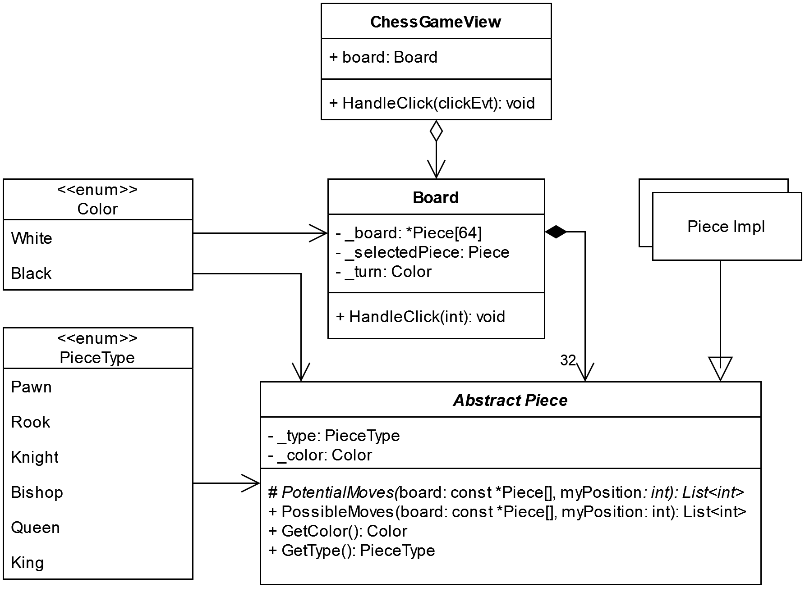

# AMS Project

## Software Design

The AMS Project is a sophisticated chess game designed to run on an STM32 microcontroller using the TouchGFX framework. The project is a culmination of the AMS (Applied Microcontroller Systems) course, and it showcases the implementation of an interactive chess game with various advanced features. Below is an overview of the core components and functionality of the chess game.

### TouchGFX Integration

The chess game is developed using TouchGFX, a graphical framework used for developing interactive GUIs for embedded systems.

### Class Diagram

## Features

- **Interactive Chessboard**: The chessboard is fully interactive, allowing users to select and move pieces with touch gestures.
- **AI Opponent**: The game includes a basic AI opponent with configurable difficulty.
- **Game Saving and Loading**: Players can save their game progress and load it later.
- **Timers**: Each player has a timer to keep track of their thinking time.
- **Visual Feedback**: The game provides visual feedback for selected pieces, valid moves, and checks.

## Project Background

### Development Environment

The project was developed using an STM32 microcontroller development board with an integrated touchscreen, WiFi, and SD card reader. The STM32 development tools, IDEs, and examples were utilized to develop the game.

### Development Process

The project followed an agile development process with an initial focus on rendering graphics on the screen and moving pieces. Subsequently, more complex chess logic was implemented. A Scrum board on GitLab was used to manage tasks and updates throughout the development cycle.

### Team Members

- **Anders Lillelund Clausen**:
- **Mathias Gorm Petersen**:

## Research and useful links

- [Micro-Max](https://home.hccnet.nl/h.g.muller/pcsqr.html): A very simple chess engine, though hard to read.
- [Fairy-Max](https://home.hccnet.nl/h.g.muller/CVfairy.html): Based on Micro-Max, slightly more complex but also hard to read.
- [CT-800](https://www.ct800.net/download.htm): A semi-simple chess engine that is quite complex.
- [UCI](https://www.chessprogramming.org/UCI): Universal Chess Interface, a terminal format for chess engines.
- [StockFish](https://github.com/official-stockfish/Stockfish): A very capable chess engine, too large and resource-intensive for microcontrollers.
- [DockFish](https://gitlab.com/ce72/dockfish): Dockerfile for StockFish, a very capable chess engine.
- [OneDrive](https://aarhusuniversitet-my.sharepoint.com/:f:/r/personal/au700926_uni_au_dk/Documents/SW6/AMS?csf=1&web=1&e=QqWXtH): Project OneDrive for files.
- [Chess Terms](https://www.chess.com/terms): Chess terms from chess.com for edge case rules.

## Presentation

A presentation of the project is available in the following video:

[AMS Project Presentation](https://www.youtube.com/watch?v=8L-S7ZYVGmU)